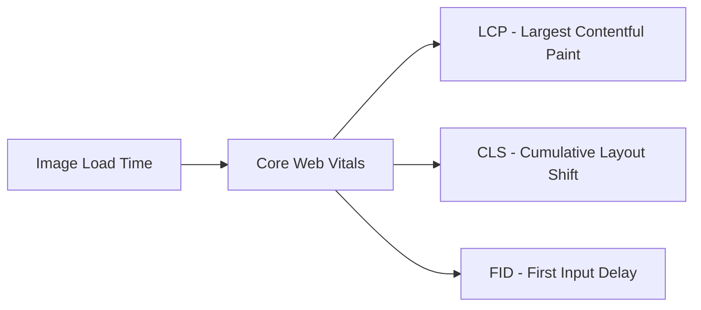

## 🖼️ Mastering Image Optimization in Nuxt 3: A Complete Guide

> "A picture is worth a thousand words, but it shouldn't cost a thousand kilobytes."

## Introduction 🚀

Image optimization is crucial for modern web applications. Poor image optimization can lead to:

- Slower page loads
- Higher bounce rates
- Decreased SEO rankings
- Poor user experience

::alert{type="info"}
**Did you know?** Images typically account for 50% of a webpage's total weight.
::

## Setting Up Nuxt Image 🛠️

First, let's set up `@nuxt/image` in your project:

```bash [terminal]
# Install the module
npm install --save-dev @nuxt/image
```

Add it to your `nuxt.config.ts`:

```ts [nuxt.config.ts]
export default defineNuxtConfig({
  modules: ['@nuxt/image'],
  image: {
    // Nuxt Image Module Options
    provider: 'ipx',
    quality: 80,
    format: ['webp', 'jpg', 'png'],
    screens: {
      xs: 320,
      sm: 640,
      md: 768,
      lg: 1024,
      xl: 1280,
      xxl: 1536
    }
  }
})
```

## Basic Image Optimization ⚡

### 1. Using the `<NuxtImg>` Component

```vue [NuxtPhoto.vue]
<template>
  <NuxtImg
    src="/images/hero.jpg"
    alt="Hero Image"
    width="800"
    height="400"
    loading="lazy"
  />
</template>
```

### 2. Responsive Images

```vue [NuxtPhoto.vue]
<template>
  <NuxtImg
    src="/images/hero.jpg"
    sizes="sm:100vw md:50vw lg:400px"
    preload
  />
</template>
```

::alert{type="warning"}
**Important:** Always specify image dimensions to prevent layout shifts!
::

## Advanced Techniques 🎯

### Image Format Selection

::disclosure{title="Click to see format selection logic"}
First, create a utility function to handle format selection:

```ts [utils/imageFormatSelector.ts]
const formats = {
  jpeg: 'image/jpeg',
  webp: 'image/webp',
  avif: 'image/avif'
};

const selectFormat = (formats: string[]) => {
  // Format selection logic
  return formats.find(format =>
    typeof window !== 'undefined' &&
    window.navigator.userAgent.includes(format)
  ) || 'jpeg';
};
```

Then create a reusable component that uses this utility:

```vue [components/OptimizedImage.vue]
<script setup lang="ts">
import { selectFormat } from '~/utils/imageFormatSelector'

const selectedFormat = ref(selectFormat(['webp', 'jpeg']))

// Props for component customization
interface Props {
  src: string
  alt: string
  width?: number
  height?: number
}

const props = withDefaults(defineProps<Props>(), {
  width: undefined,
  height: undefined
})
</script>

<template>
  <NuxtImg
    :src="src"
    :alt="alt"
    :format="selectedFormat"
    :width="width"
    :height="height"
    loading="lazy"
  />
</template>
```

Usage in your pages or components:

```vue [pages/index.vue]
<template>
  <OptimizedImage
    src="/images/hero.jpg"
    alt="Hero Image"
    :width="800"
    :height="400"
  />
</template>
```

::

### Custom Image Provider

```ts [nuxt.config.ts]
export default defineNuxtConfig({
  image: {
    provider: 'cloudinary',
    cloudinary: {
      baseURL: 'https://res.cloudinary.com/your-account/image/upload/'
    }
  }
})
```

### Progressive Loading

```vue [NuxtPhoto.vue]
<template>
  <NuxtImg
    src="/images/hero.jpg"
    placeholder
    blur="30"
  />
</template>
```

## Best Practices 📝

| Practice          | Description                           | Impact                   |
| ----------------- | ------------------------------------- | ------------------------ |
| Use WebP          | Modern format with better compression | 25-35% smaller files     |
| Lazy Loading      | Load images only when needed          | Faster initial page load |
| Responsive Images | Different sizes for different screens | Optimal delivery         |
| Width/Height      | Always specify dimensions             | Prevents CLS             |

### ✅ Do's

- Implement lazy loading for below-fold images
- Use modern formats like WebP with fallbacks
- Specify image dimensions
- Use responsive images for different viewports

### ❌ Don'ts

- Load full-size images for thumbnails
- Skip image alt texts
- Ignore WebP support
- Use oversized images

## Performance Metrics 📊

Monitor these key metrics:



> 🎯 **Target Metrics**:
>
> - LCP: < 2.5s
> - CLS: < 0.1
> - Image weight: < 200KB for hero images

## Debugging Tools 🔧

1. Chrome DevTools
   - Network tab
   - Performance tab
   - Lighthouse
2. Nuxt Image Inspector

  ```bash \[.env]
   # Enable in development
   NUXT_IMAGE_PROVIDER_ENABLE_INSPECTOR=true
   ```

## Conclusion 🎉

Image optimization in Nuxt 3 is a powerful way to improve your application's performance. By following these guidelines, you can ensure your images load quickly while maintaining quality.

---

### Resources 📚

- [Nuxt Image Documentation](https://image.nuxt.com/)
- [Web.dev Image Optimization](https://web.dev/fast/#optimize-your-images)
- [Core Web Vitals](https://web.dev/vitals/)
